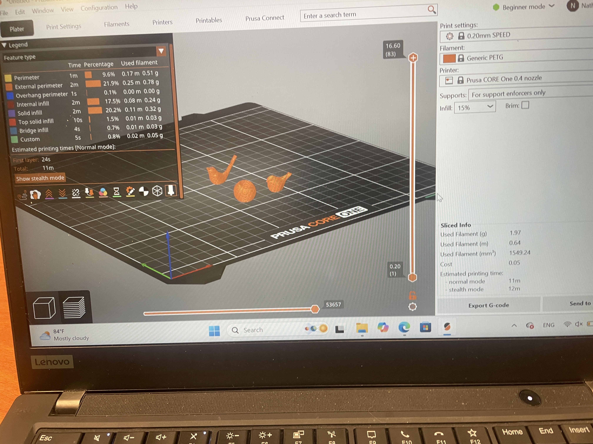
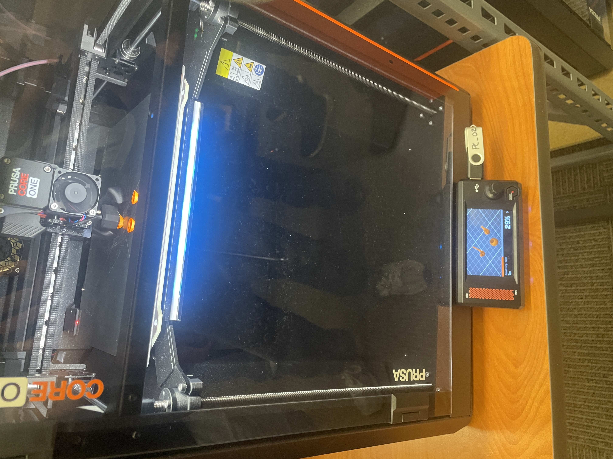
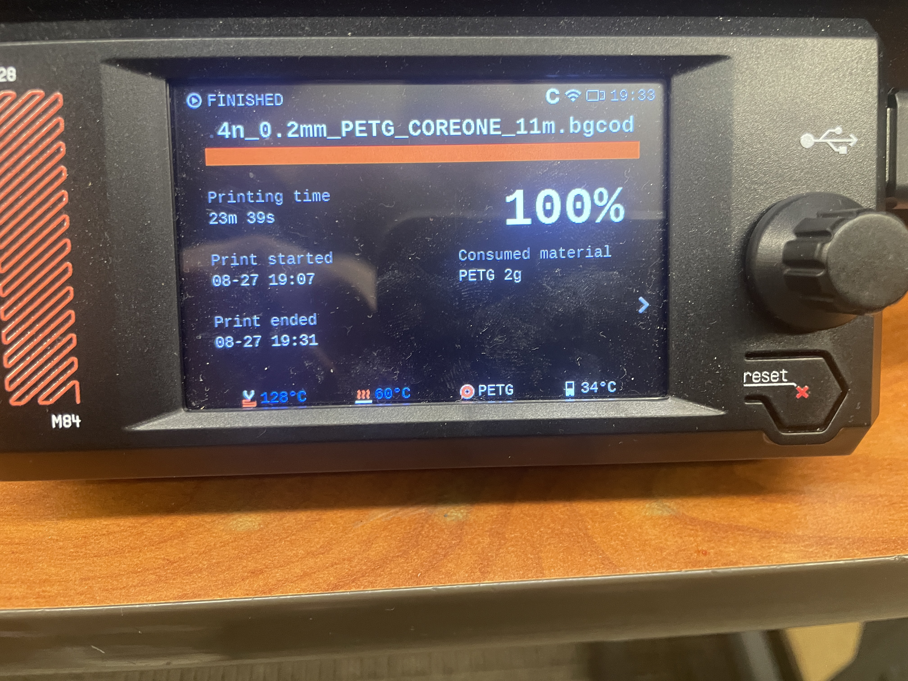
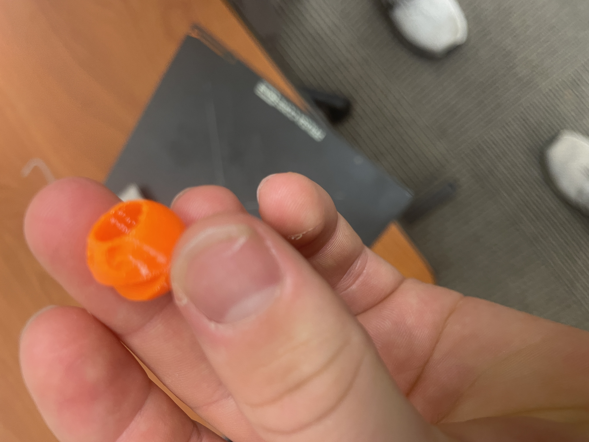
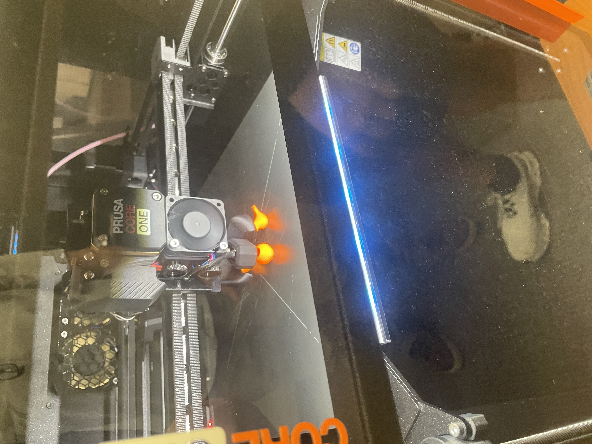

# Lab 2 First Print

## Question
What is the difference between additive and Subtractive Manufacturing?

Additive manufacturing usually starts with nothing and adds material until a item is manufactured While Subtractive Manufacturing relies on a use of a cutting and subtractive processes to reduce a larger block into a desired Item.
## Design Rules in DfAM
For FDM printing, some common DfAM design rules are:

"Use a flat build surface so the part adheres well to the print bed.
Minimize overhangs greater than about 45° when possible to reduce the need for supports.
Avoid unnecessary supports, because they add print time, material, and cleanup.
Make walls thick enough to print reliably; very thin features may not print correctly.
Consider build orientation, since orientation affects surface finish, strength, support requirements, and printing time.
Allow clearance between moving or mating parts because printed dimensions are not perfectly exact.
Avoid extremely small details that are smaller than the printer's nozzle or practical layer resolution.
Design with layer direction in mind because FDM parts are generally weaker between layers than along the printed layers.
Reduce unnecessary material when possible to decrease weight, filament use, and print time.
Check overall dimensions and print time before printing to make sure the design meets the project constraints." Chat GPT

## Print Something Small

##Download
https://www.printables.com/model/521268-pacman-and-ghosts-pot-plant
I chose this model because I always Liked playing pacman.
##PRUSASCLICER
I used Prusa slicer to process my stl file for it to 3d print. I chose this because it was free. I orientated the parts so that the flat surface or my part was on the printing bed. Since there was a solid flat surface on the bottom of my part and the contours of the part did not overhang much, I did not use any supports. I did shrink it down to 30% of the original scale so it would 3d print in 9 minutes. Prusa slicer made everything very easy and simple and I had no problems through this process.
##THE PRINT
I printed with Nathan Zimmermann and Eshan Thanker. The process was easy. This was on the core One Printer 1 and the material was Pep G

