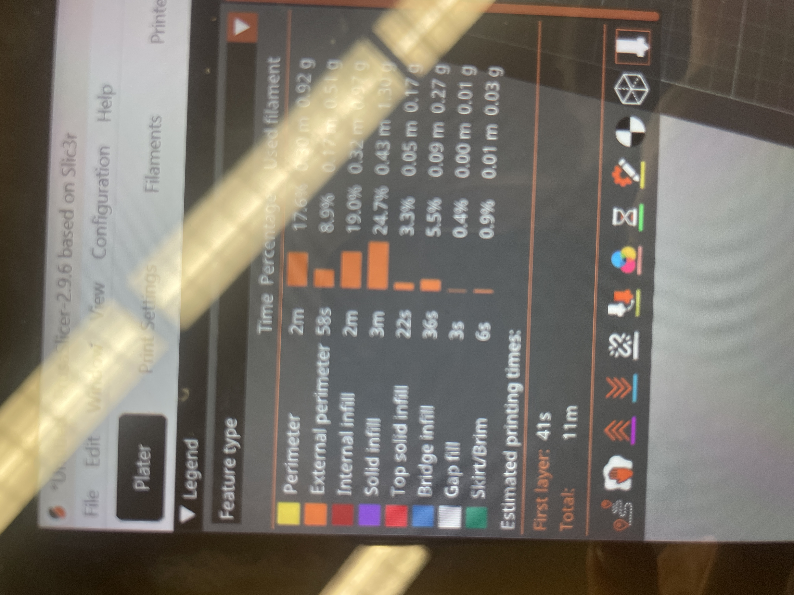
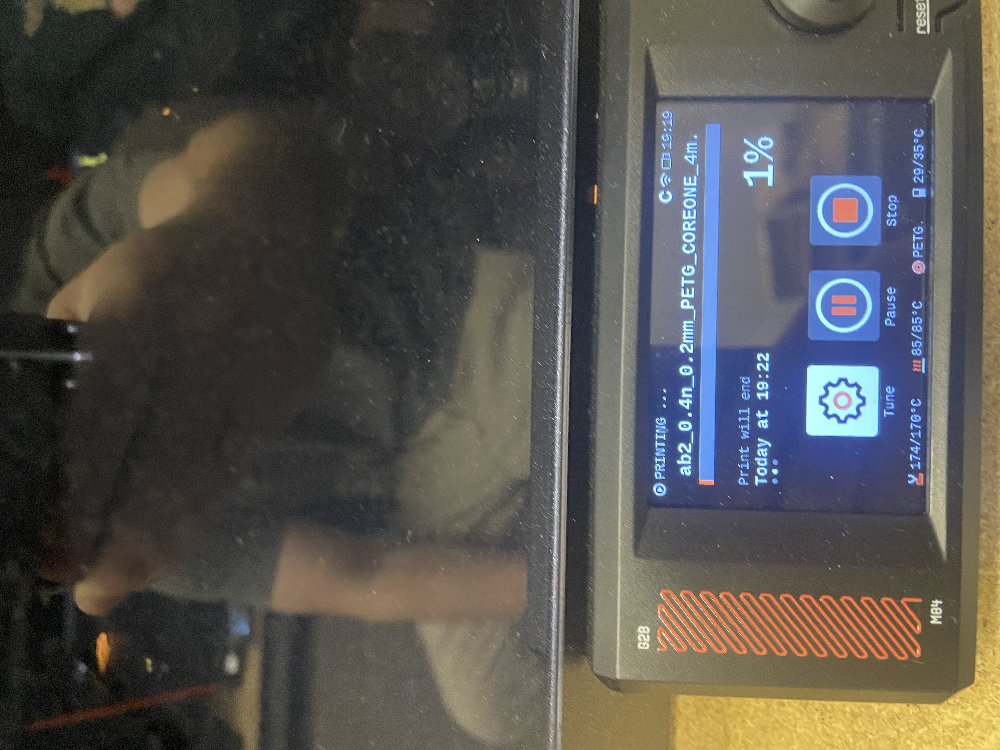
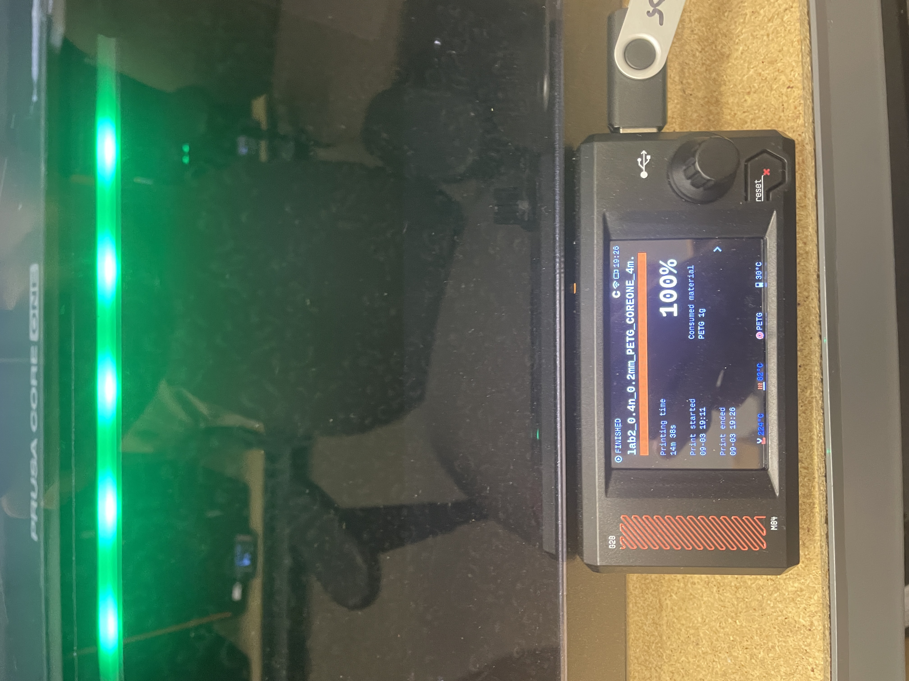

# Lab3 Design Something Small
### Design

### Pre Print Processing
### Print
### Lessons Learned
### Questions to answer
In your documentation, directly answer these three questions from the live demo:
How does percentage infill affect mechanical properties?
How do different infill patterns affect mechanical properties?
Why use different wall thicknesses?
### Resources
Through this assignment I used Three resources on my computer. I used Creo Parametric to Design my part I used Prusa Slicer for the Pre Print Processing and then I used The printers in the lab to Print it. I also had some help from Nathan Zimmmerman and Dr Fagan with some questions I had while doing this project.

