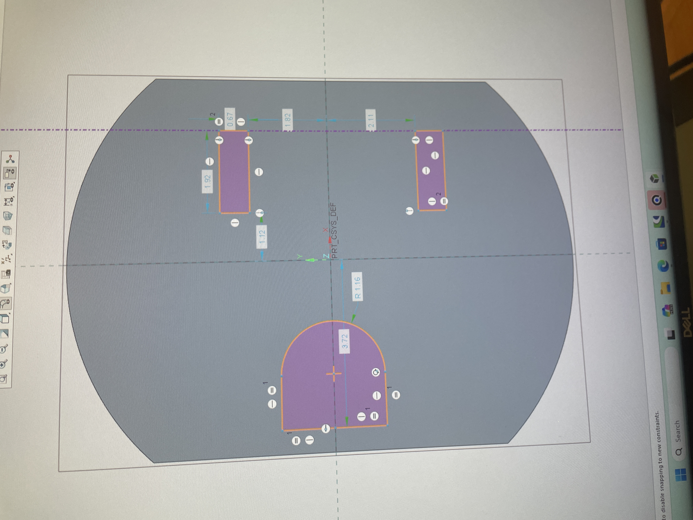
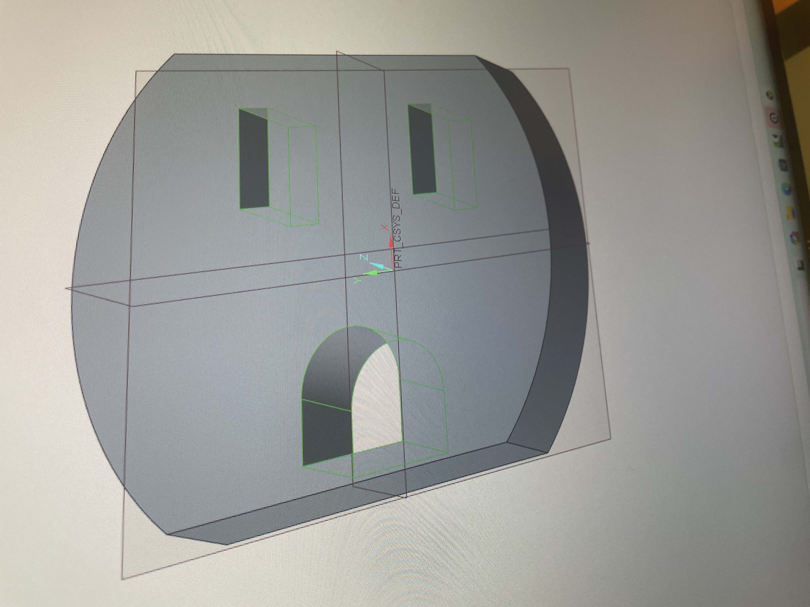
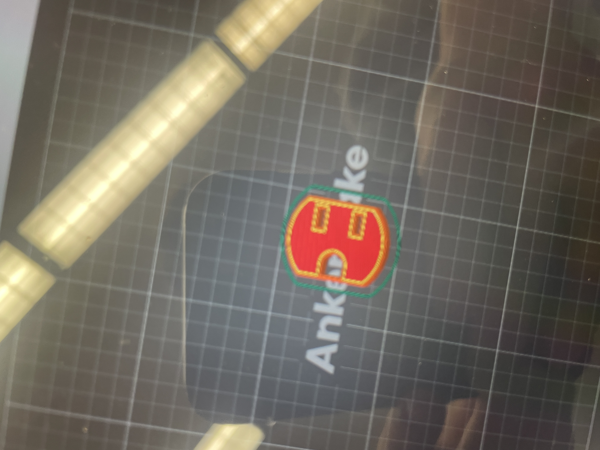
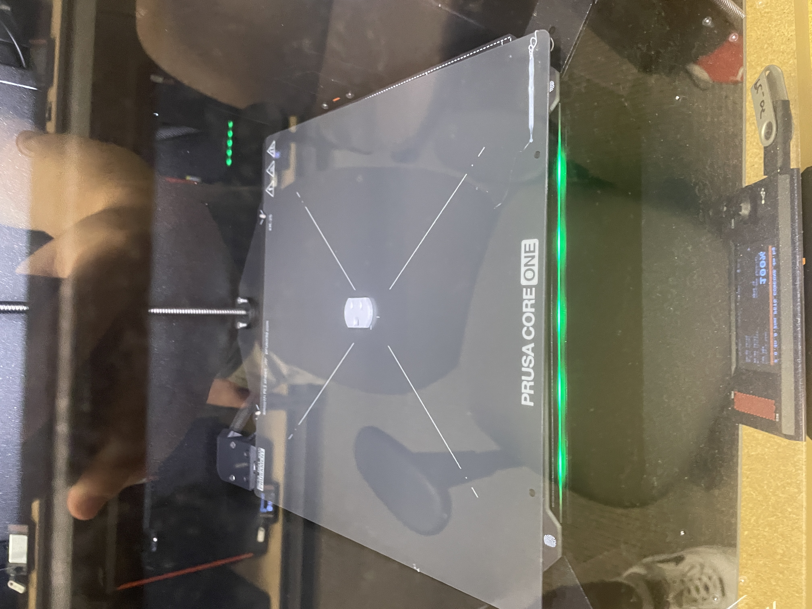
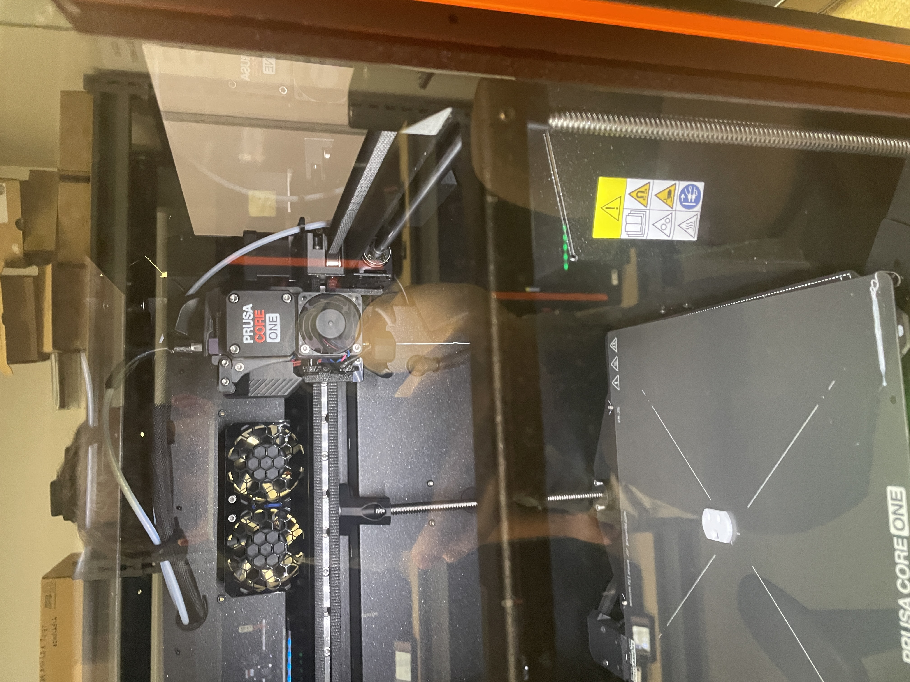

# Lab3 Design Something Small
### Design
I decided to model an outlet Plug. I chose this because it was Infront of me but it is one of the most important things we interact with every day. How we safely tap into electricity is very important. I know it seems pretty boring and I would probably agree but you cannot say that it is not relavent.

### Research
We were tasked with discovering three new infills that were not talked about in class
#### Cross 3D 
Flexible parts,
TPU and other soft materials,
Lower stiffness,
Compression and deformation capability
#### Octagram Spiral
Lightweight internal support,
Decorative or experimental prints,
Continuous spiral-like extrusion,
Lower structural strength than cubic or gyroid patterns
#### Hilbert Curve
Flexible, continuous toolpath,
Reduced travel moves,
More uniform internal fill,
Lower directional stiffness than grid-style infill

### Pre Print Processing
#### I used the default orientation and scale because It was perfect for the time I had left in class as well as there was no need for supports with the way I set it up.
We looked at trying out different infills and you wanted to know what I chose for this project. For the infill I chose 30% because on the printer I didn't love how much space was left inside the part last time I printed at 25%. I also did not go up to something like 50% because I thought that might be a waste of money. I changed the pattern to stars because I thought that was way cooler than the base design. I also want to answer some questions on the rubric.
How does percentage infill affect mechanical properties? The infill will help determine how stiff it is and If it is super stiff It might be more brittle.
How do different infill patterns affect mechanical properties? The different infill patterns shift around where a failure point may be. For different infills there are different starting points for the strains aswell as
Why use different wall thicknesses? The different wall thinness matters If you want your part to have a higher structural rigidity if it is a round piece. If you have apart that is designed to wear the thickness of the walls are important. I chose my new thickness out of pure vanity and for the fact that we had to because Int this particular project I was not trying to achieve any crazy mechanical goals on my under engineered part.

### Print
My Print was made of PETG and took 4 minutes to complete since th start of printing that is why there is no mid print photos because It went so fast. My print met all Physical requiremnts which will be inspected in class.
Movie : https://drive.google.com/drive/folders/1ESFeaWSr4QqMpWqN5K4x8xtdz4wsImEo?usp=drive_link

### Lessons Learned
I learned that That I should think about Ideas of what I want to make before coming into class because there is all of the labs posted online. I also made the mistake of not watching my print the whole time and making my print so small it barely even took 5 minutes. The Scale looks a little odd for it to look Like I deigned it to be.
### Questions to answer
In your documentation, directly answer these three questions from the live demo:
How does percentage infill affect mechanical properties?
How do different infill patterns affect mechanical properties?
Why use different wall thicknesses?
### Resources
Through this assignment I used Three resources on my computer. I used Creo Parametric to Design my part I used Prusa Slicer for the Pre Print Processing and then I used The printers in the lab to Print it. I also had some help from Nathan Zimmmerman and Dr Fagan with some questions I had while doing this project.
