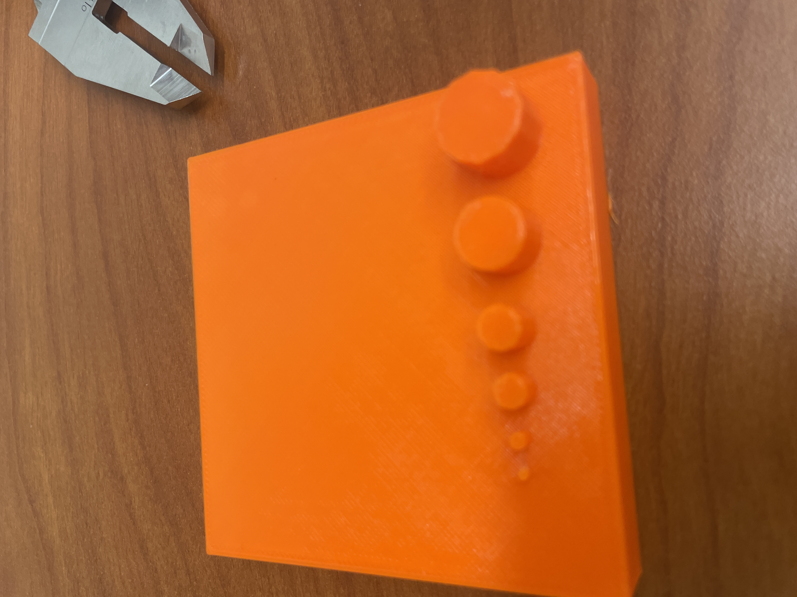

# Lab4 – Benchmark a Parameter
Instructions
Design an artifact in which benchmarks a parameter for the Prusa 3D printer.
Documentation and Grading:
Example HERE
### Parameter (5%)
## Project Images

Detail what parameters you are trying to characterize.
### Document Design (35%)

Document the design process which includes many pictures with an overview of images.
Detail the steps and reasons/decisions from start to finish.
### Preprocessor (30%)

Detail the reasons why you choose the build parameters in the pre-processor. Note the slice information on Prusaslicer. Some, not all questions, to answer are outlined below to guide your documentation.
Why choose the infill?
Why choose the build orientation?
Did you use supports if so, how did you do add supports in the software.
Did you need to scale, if so why and how?
Detail any mistakes throughout the process.
### Print Artifact (10%)

Post a picture of the first layer calibration.
Print artifact and describe what the artifact tested.
Embed Video of the artifact build.
Was the outcome different than what you originally thought?
## Video
-----------------------------------------------------------
https://youtu.be/Wwpaoy1UOgA

### Lessons Learn (15%)

Detailed lessons learned and things you would change throughout the process, you should learn a minimum of four things. Be specific, use more articulate, engineering, and 3D print and design language.
Actual time it took from start to finish.
### (5%) Resources

