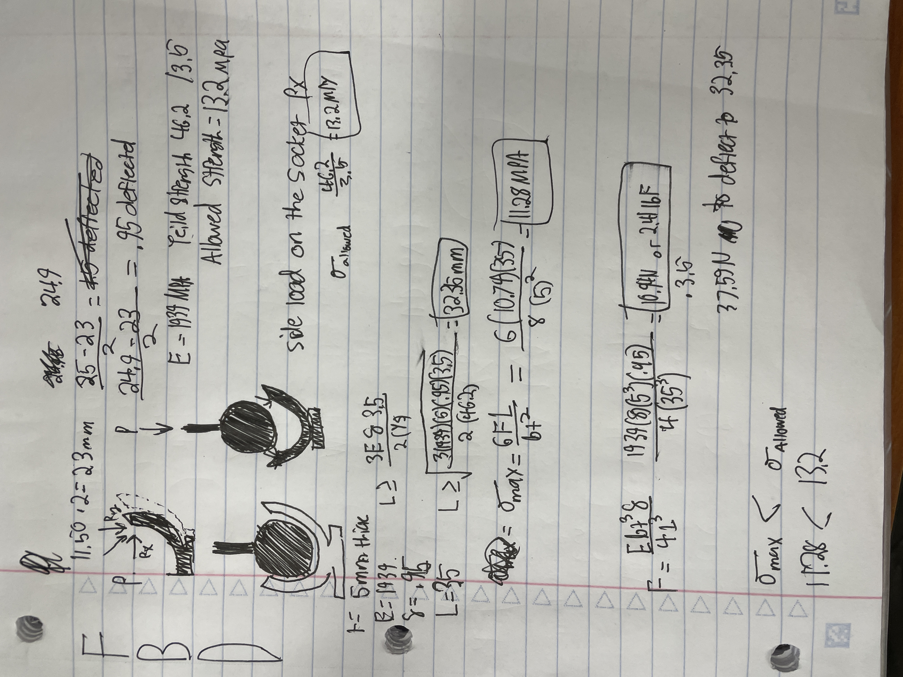

# Lab 5 – Design a Snap Fit
For this lab I designed a ball and socket joint which I wanted to work like an automotive manual transmission shifter.
## Documentation:
--------------------------------------------------------------------------------------------------
(35%) Modeling
So, I modeled my ball and socket joint as you intended us to. The ball and socket Joint had thickness of 5mm and an outside L of 35mm and a inside of 25. The ball that was received into the socket was 24.9mm and had to go through a 23mm diameter whole to pop in. I had to Split the socket in half to draw a free body diagram and model the force that causes the deflection. This force is in the x direction. The ball that pops in comes in vertically. The way it works is the ball that is on the top and hits the socket at an angle which then gives it the x force it needs to deflect.

## (35%) Parametrically design (No credit for this section if you do not use parametric design)
----------------------------------------------------------------------------------------------------------
Here are photos of the design I made where I used to revolve to make the ball and socket. I completed the designes with extrudes. An imortant extrude was once through the socket to allow it to be elastic. 

## (30%) 3D printing  and Test
----------------------------------------------------------------------------------------------------
I 3d Printed all of the parts in PETG and when I took them of the 3d printer I realized that I messed up. I did not design the parts well because they did not all fit together.

### Outline reasons for the pre-processor layout.
#### Reason why you chose one of the support systems.
I chose the standard support because It was the first that popped up.
#### Outline reasons for build orientation.
I Put the biggest flat surface I could on the plate so that there would be limited overhangs. This did effect the socket though and If I were to do it again I would have the socket as a separate peice than the base so that the socket could have verical print lines for the layering orientation.
#### Outline slicer settings and reasons for the settings.
I used 15% for the socket and Gate but I used 100% for the ball. this is because it broke initially when I took it off the printer
#### If you use supports, outline the reasons.
I used to support on the ball for the socket because for the geometry for the part requires some help because the overhangs are to short.
#### mistakes throughout the process.
Well, you will grade the mistakes I hope there are not many and you will be kind. The mistakes I made were mensioned previously in the 3d printing section.
#### Lessons
What I learned from this was that the
#### Resources 
- I used the 3d Printing lab the internet and ChatGPT for research. This lab took me 8 hours to complete including class.
